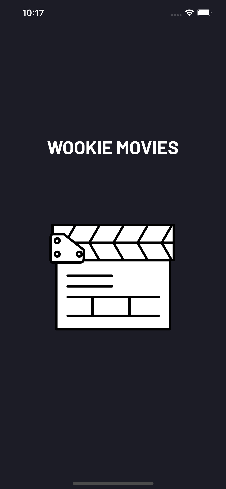
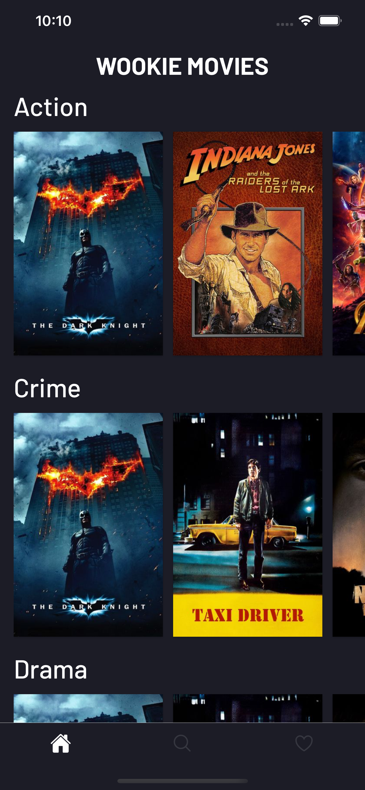
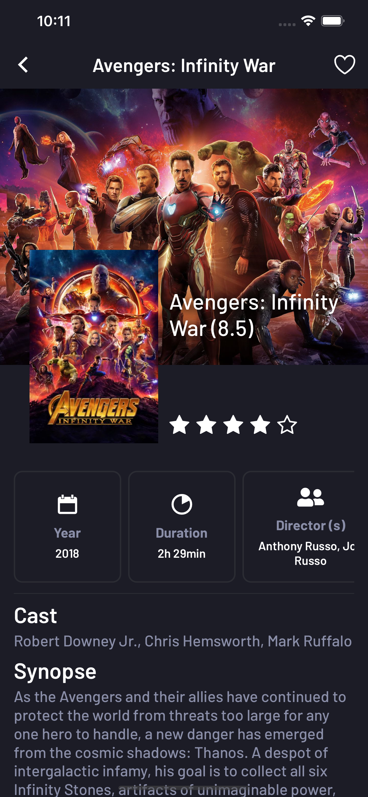
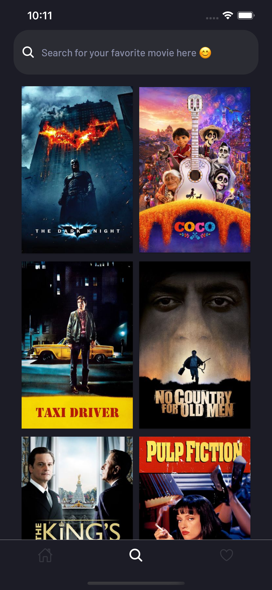
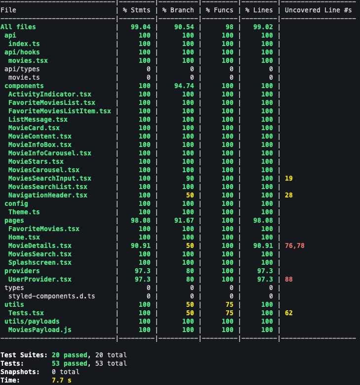

# Wookie Movies
The Wookie Movies app is a mobile application to help movies affectionate to stay up-to-date with new movies releases.  
It also helps users to search for their favorite movies. They can also mark movies as favorites and they will be displayed in the favorites section.

## Screenshots

  
  
  
  
  

## Local development
- Run `yarn` to install projects dependencies. It is also recommended to install `expo-cli` you can do this by running `yarn global add expo-cli`
- To start the development server run `yarn start`. 
- Press `i` to open the app in an iOS simulator or `a` to open it in an Android simulator
- This project was developed with the following device simulators: 
  - Iphone SE
  - Iphone 12 Pro Max
  - Iphone 11
  - Google Pixel 2

## Testing 
- Application testing is written using `@testing-library/react-native` and the test runner is `jest`
- To extend jest rules `@testing-library/jest-native` was used 
- To test network layer `msw` was used 
- To run all tests: `yarn test` 
- To run jest in watch mode (recommended for development): `yarn test:watch`
- To get code coverage: `yarn test:coverage`. This project has test coverage above 90%

  

## Main Technologies
- Expo
- React Native (0.63)
- React Navigation
- React Query
- Axios
- Async Storage
- Lottie 
- Styled Components

## Extra Feature: Favorite Movies
This feature turns possible for users to favorite movies on the movie details page. To favorite a movie, users need to press on heart icon on the top right corner of movie details page. To see all favorited movies there's a tab on bottom tab navigator marked with a heart icon as well. This feature uses React's Context API and also provides a custom hook `useUserContext` to easily consume data. When the application starts, it loads from Async Storage all favorited movies. When a user favorites a movie or removes a movie from favorites async storage is immediately triggered to persist the user's action. 

## Next Steps 
[ ] Integrate with Rotten Tomatoes API to enrich movie details page.  
[ ] Create an advanced search feature to habilitate users to query movies by actors, directors, years or genres.

## Credits 
App developed by: Alex Freire Spinola  
[Lottie clapperboard animation](https://lottiefiles.com/19117-movie-clapperboard)   
[App icon](https://www.flaticon.com/free-icon/clapperboard_1038100?term=movie&page=1&position=12&page=1&position=12&related_id=1038100&origin=search)  
[Cinema Booking App - Concept Layout ](https://dribbble.com/shots/16222673/attachments/8084825?mode=media)  